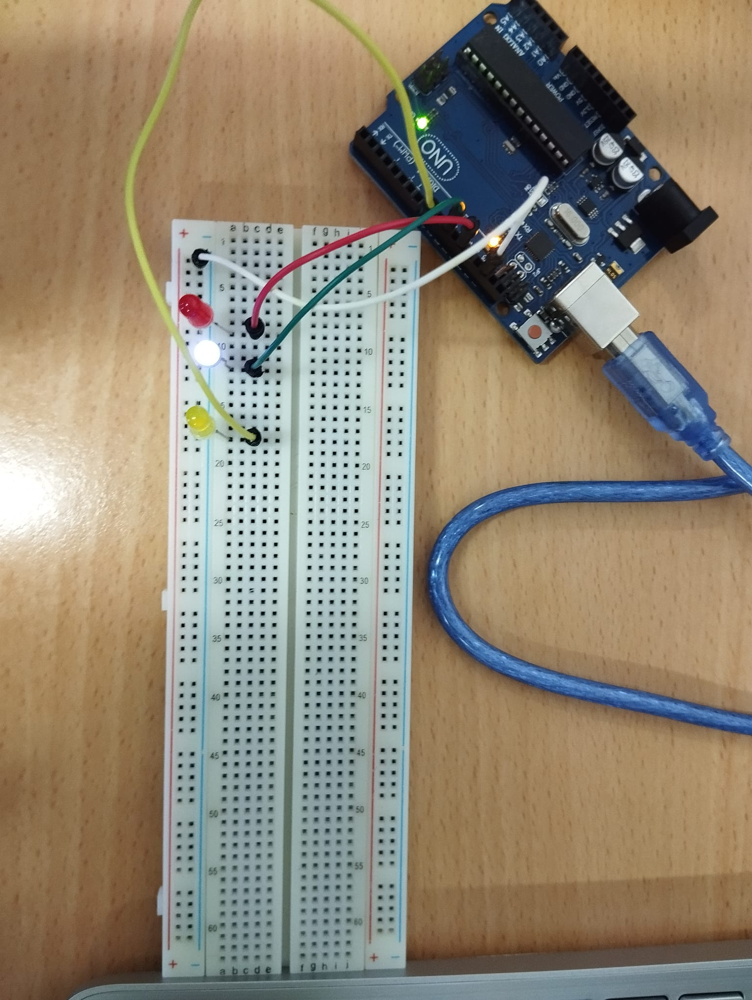

# Simulando un Semáforo - Arduino





## Introducción
En esta práctica, se ha implementado un sistema que simula el funcionamiento de un semáforo utilizando LEDs y Arduino. El semáforo tiene tres luces (rojo, amarillo y azul) que se encienden en un orden específico, con un tiempo de encendido que disminuye en cada ciclo.

## Tecnologías empleadas:
- Arduino  
  

## Código

```cpp
int ledRoja = 12;
int ledAmarilla = 10;
int ledAzul = 8;
int tiempoEncendido = 2000;  // Duración inicial en milisegundos

void setup() {
  pinMode(ledRoja, OUTPUT);
  pinMode(ledAmarilla, OUTPUT);
  pinMode(ledAzul, OUTPUT);
}

void loop() {
  // Encender LED Rojo
  digitalWrite(ledRoja, HIGH);
  delay(tiempoEncendido);
  digitalWrite(ledRoja, LOW);
  
  // Encender LED Amarillo
  digitalWrite(ledAmarilla, HIGH);
  delay(tiempoEncendido);
  digitalWrite(ledAmarilla, LOW);

  // Encender LED Azul
  digitalWrite(ledAzul, HIGH);
  delay(tiempoEncendido);
  digitalWrite(ledAzul, LOW);
  
  // Reducir tiempo de encendido en 100ms por ciclo, con un mínimo de 100ms
  tiempoEncendido = (tiempoEncendido > 100) ? tiempoEncendido - 100 : 100;
}
```
## Realizado por:
**Cristina Fernández**  
[Portfolio](https://portfoliocristina.netlify.app)


